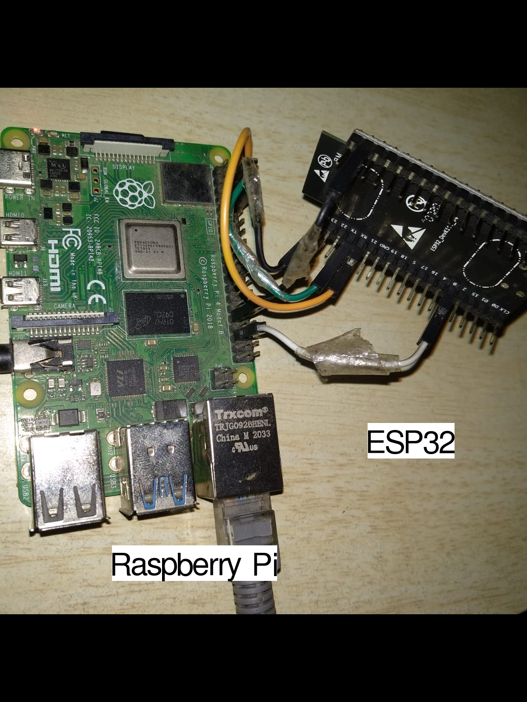

# Raspberry Pi example

## Overview

Example demonstrates how to flash ESP32 from Raspberry Pi 4 (Model B) using esp_serial_flash component API. AT command firmware to be flashed from Raspberry Pi to ESP32 can be found in `binaries`. USART0 is dedicated for communication with ESP32.

Following steps are performed in order to re-program target's memory:

1. Peripherals are initialized.
2. Host puts slave device into boot mode tries to connect by calling `esp_loader_connect()`.
3. Then `esp_loader_flash_start()` is called to enter flashing mode and erase amount of memory to be flashed.
4. `esp_loader_flash_write()` function is called repeatedly until the whole binary image is transfered.
5. At the end, `loader_port_reset_target()` is called to restart ESP32 and execute updated firmware.

Note: In addition, to steps mentioned above, `esp_loader_change_baudrate`  is called after connection is established in order to increase flashing speed. Bootloader is also capable of detecting baud rate during connection phase, and can be changed before calling `esp_loader_connect`. However, it is recommended to start at lower speed and then use dedicated command to increase baud rate. This does not apply for ESP8266, as its bootloader does not support this command, therefore, baud rate can only be changed before connection phase in this case.

## Hardware Required

* Raspberry Pi 4 Model B. 
* A development board with ESP32 SoC (e.g. ESP-WROVER-KIT, ESP32-DevKitC, etc.).
* USB cable in case ESP32 board is powered from USB. ESP32 can be powered by Raspberry Pi as well.

## Hardware connection

Table below shows connection between Raspberry Pi and ESP32.

| Raspberry Pi (host) | RPi Pin no |    ESP32 (slave)    |
|:-------------------:|:----------:|:-------------------:|
|        GPIO19       |     35     |         IO0         |
|        GPIO06       |     31     |       RST/EN        |
|        GPIO14       |     8      |         RX0         |
|        GPIO15       |     10     |         TX0         |
|         GND         |     6      |         GND         |

Setup should look like


Optionally, UART-to-USB bridge can be connected to PD5(RX) and PD6(TX) for debug purposes.

## Installation

### GPIO library
Raspberry Pi makes use of [pigpio](http://abyz.me.uk/rpi/pigpio/) library in order to simplify controlling GPIO pins. Some distributions of 'Raspberry Pi OS' may come with `pigpio` already installed. Presence of the library in the system can checked by running command:
```
pigpiod -v
```

If not present, run following commands to install the library. 
```
sudo apt-get update
sudo apt-get install pigpio
```

### Enable UART
On Raspberry Pi 4, primary UART (UART0) is connected to the On-board Bluetooth module by default.
In order to enable serial communication on this UART, run following command in terminal:
```
sudo raspi-config
```

* Navigate to **Interfacing Options -> Serial**.
* Then it will ask for login shell to be accessible over Serial, select **No**.
* After that, it will ask for enabling Hardware Serial port, select **Yes**.
* Reboot the Raspberry Pi.

## Build and run

Disconnect and connect power of ESP32

To compile the example:

Create and navigate to `build` directory:
```
mkdir build && cd build
```
Run cmake, build example and run example: 
```
cmake .. && cmake --build . && ./raspberry_flasher
```

## Sample log
```
pi@raspberrypi:~/esp-serial-flasher/examples/raspberry_example/build $ cmake .. && cmake --build . && sudo ./raspberry_flasher
-- Configuring done
-- Generating done
-- Build files have been written to: /home/pi/esp-serial-flasher/examples/raspberry_example/build
[ 66%] Built target flasher
Scanning dependencies of target raspberry_flasher
[ 77%] Building C object CMakeFiles/raspberry_flasher.dir/Src/main.c.o
[ 88%] Linking C executable raspberry_flasher
[100%] Built target raspberry_flasher
Connected to target
Baudrate changed
start flashing boot
File ../../binaries/hosted_bin/bootloader.bin opened. Size: 25376 bytes
Erasing flash (this may take a while)...
Start programming
Progress: 100 %
Finished programming
start flashing part
File ../../binaries/hosted_bin/partition-table.bin opened. Size: 3072 bytes
Erasing flash (this may take a while)...
Start programming
Progress: 100 %
Finished programming
start flashing app
File ../../binaries/hosted_bin/network_adapter.bin opened. Size: 820688 bytes
Erasing flash (this may take a while)...
Start programming
Progress: 100 %
Finished programming
```

For more details regarding to esp_serial_flasher configuration, please refer to top level [README.md](../../README.md).
